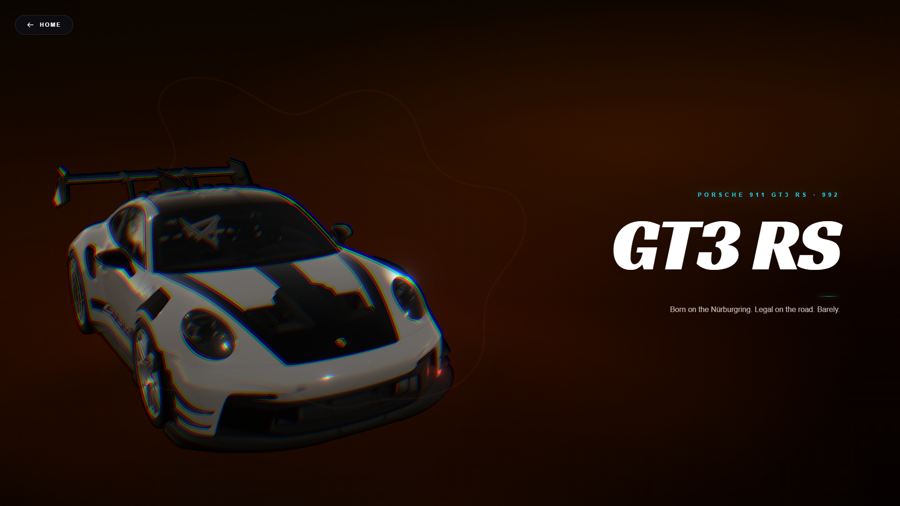
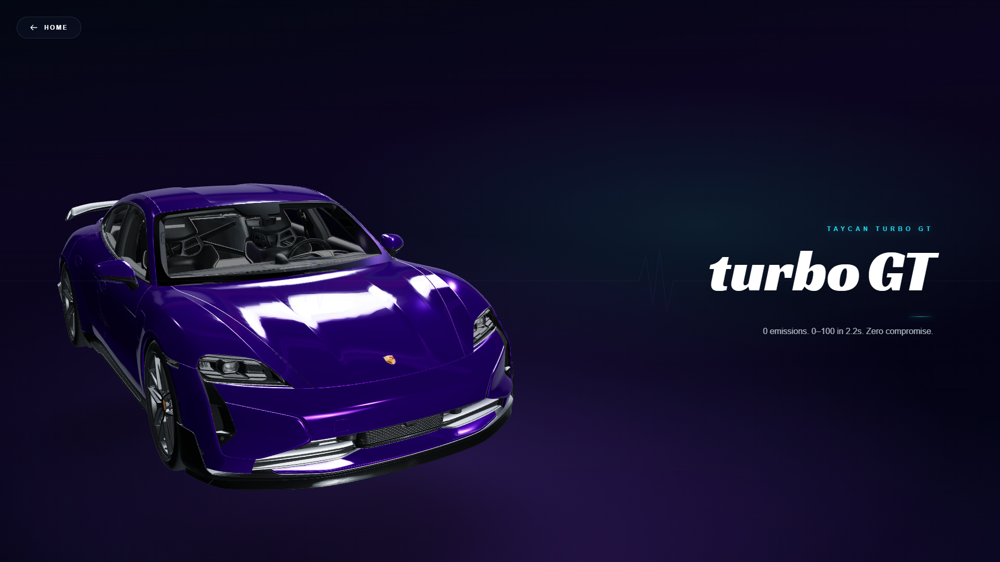
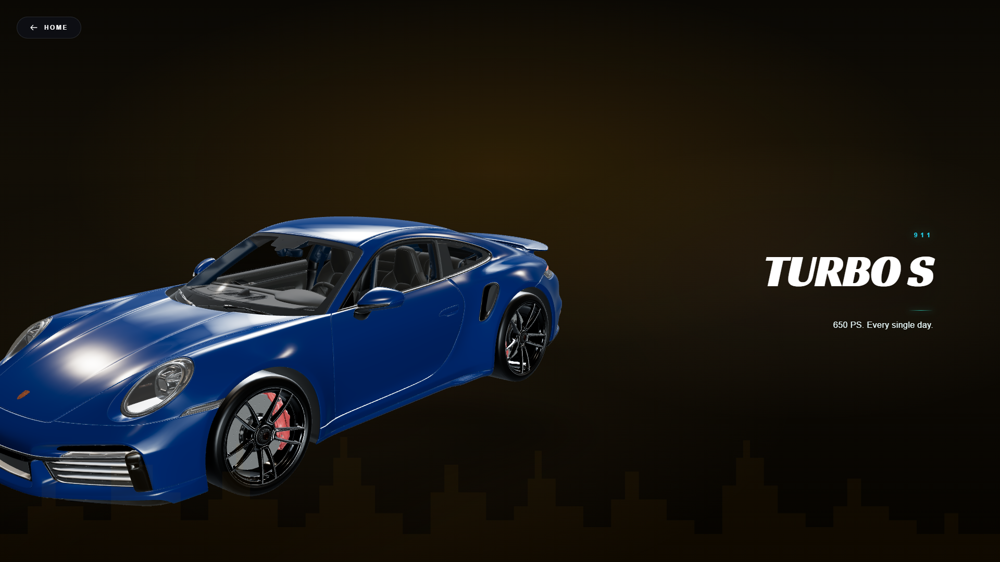
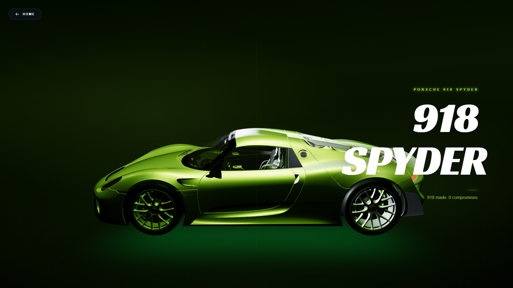

# 🏎️ Porsche Ultimate Showroom

Welcome to the **Porsche Ultimate Showroom**, a high-performance, visually stunning React & Three.js application designed to showcase the beauty, engineering, and spirit of Porsche. 

This project goes beyond standard 2D websites by integrating **interactive 3D models**, cinematic post-processing (Bloom, Vignettes, Holographic grids), and highly dynamic scroll-driven choreography using **GSAP** and **React Three Fiber**.

---

## 🌟 Features

- **Interactive 3D Showrooms**: Full 3D representations of the 911 GT3 RS, 911 Turbo S, Taycan, Cayenne, and 918 Spyder.
- **Cinematic Rendering**: High-end WebGL post-processing including Bloom, Depth of Field, Chromatic Aberration, and Mirror floors.
- **Scroll-Driven Choreography**: As you scroll down the page, the 3D models animate, rotate, zoom, and react to the text sections seamlessly using GSAP `ScrollTrigger`.
- **Dynamic Lighting**: Environmental HDR lighting that shifts dynamically. Watch the 911 Turbo S transition from a bright studio setup to a dark, menacing night scene instantly.
- **Backend Integration**: Full admin dashboard and contact form backend powered by Express, Node.js, and Prisma ORM.

---

## 📸 Screenshots

Here is a glimpse of the experiences built into the platform:

### 1. The Heritage & Track Ready GT3 RS
A dark, aggressive "Nocturnal Track" theme featuring bright red underglow, harsh bloom on the taillights, and track-focused aesthetic.
<br>


### 2. The Futuristic Taycan 
A glassmorphic, holographic UI showcasing the electric soul of the Taycan, complete with zooming wireframe animations and charging port highlights.
<br>


### 3. The 911 Turbo S
A dual personality — sophisticated daily driver turning into a nighttime weapon with dynamic lighting and environments.
<br>


### 4. The Iconic 918 Spyder
An "Open Sky" theme highlighting the legendary hypercar on a hyper-realistic, reflective showroom floor.
<br>


---

## 🛠️ Tech Stack

### Frontend
- **React 19**
- **Three.js** & **React Three Fiber (@react-three/fiber)**
- **Drei (@react-three/drei)** & **Postprocessing (@react-three/postprocessing)**
- **GSAP** & **ScrollTrigger** for animations
- **Tailwind CSS** for styling

### Backend
- **Node.js** & **Express**
- **Prisma ORM**
- **PostgreSQL**
- **express-validator** & **express-rate-limit**

---

## 🚀 Getting Started

### 1. Clone & Install
```bash
# Clone the repo
git clone https://github.com/your-username/porsche-showroom.git

# Install frontend dependencies
cd porsche-react-master
npm install

# Install backend dependencies
cd ../porsche-backend
npm install
```

### 2. Run the Backend
Ensure you have your `.env` configured with your Postgres database URL.
```bash
cd porsche-backend
npx prisma db push
node server.js
```

### 3. Run the Frontend
```bash
cd porsche-react-master
npm run start
```
The application will be running at `http://localhost:3000`.

---

## 🎨 Design Philosophy
The goal of this project was to avoid the generic "white background, static image" car website. Each Porsche model has a distinct personality, and the digital experience was designed to reflect that:
- **911 GT3 RS**: Raw, dark, aggressive.
- **911 Turbo S**: A dual personality — sophisticated daily driver turning into a nighttime weapon.
- **Cayenne**: Warm, family-friendly, rugged yet luxurious.
- **918 Spyder**: Open, airy, iconic hypercar presence.
- **Taycan**: Clean, digital, and futuristic.

---

Built with passion and speed. 🏁
